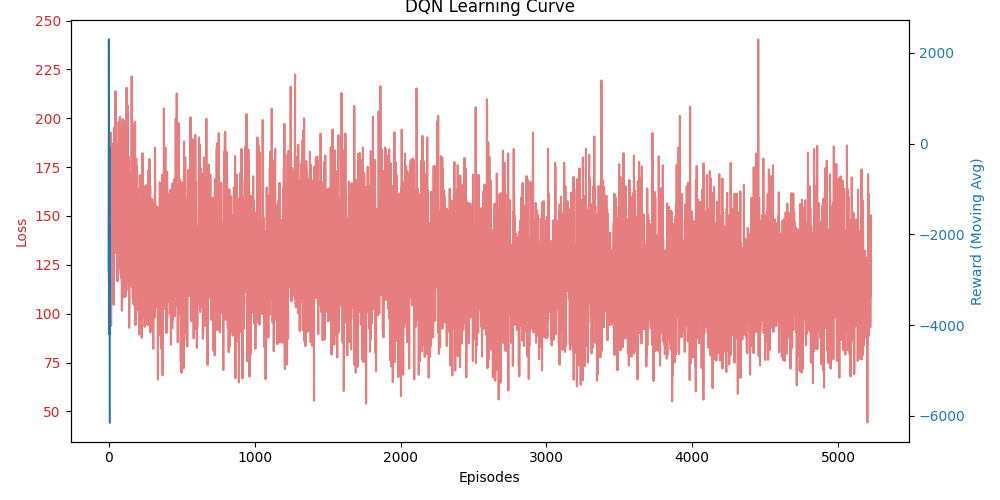
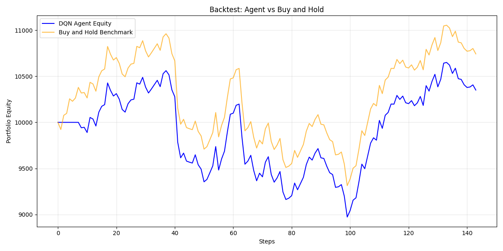

# Educational Dueling DQN Trading System

An academic Deep Reinforcement Learning project that teaches how to build a **Dueling DQN** agent for stock trading on historical Yahoo Finance data (AAPL).  
This repository prioritizes **correct RL formulation, software architecture, testability, and reproducibility** over financial promises.

---

## 1) Project Overview

The system learns a trading policy in a custom Gymnasium-style environment using a rolling market history.  
Objective: understand how a Dueling DQN can map market state to actions in a constrained all-in/all-out setup.

| Property | Value |
|---|---|
| Task type | Educational RL (not production trading advice) |
| Agent | Dueling Deep Q-Network (PyTorch) |
| Market data | Yahoo Finance OHLCV |
| Main ticker | `AAPL` |
| Data period | Config-driven (`config/setup.json`) |

---

## 2) Data Source & Pipeline

### Yahoo Finance Integration

The system uses **yfinance** to download historical OHLCV data directly from Yahoo Finance. All data handling routes through the `YFinanceDataClient` class.

| Property | Value |
|---|---|
| Data source | Yahoo Finance (via `yfinance` library) |
| Primary ticker | `AAPL` (2020-01-01 to 2023-01-01) |
| Comparative ticker | `SPY` or `NVDA` (same date range) |
| Data interval | Daily (1d) |
| Raw columns | Open, High, Low, Close, Volume (OHLCV) |

### Cache & Fallback Strategy

1. **Parquet Cache**: First download is cached at `data/raw/{ticker}_{start}_{end}.parquet` with **snappy compression**
2. **CSV Fallback**: If online fetch fails, system tries `data/raw/{ticker}.csv` with Date index
3. **Mechanism**: `YFinanceDataClient` implements all logic internally; called via `TradingSDK` facade

```python
from pathlib import Path
import yfinance as yf
import pandas as pd

TICKER = "AAPL"
START = "2020-01-01"
END = "2023-01-01"
CACHE_DIR = Path("data/raw")
CACHE_DIR.mkdir(parents=True, exist_ok=True)

cache_file = CACHE_DIR / f"{TICKER}_{START}_{END}.parquet"
required_cols = ["Open", "High", "Low", "Close", "Volume"]

if cache_file.exists():
    df = pd.read_parquet(cache_file)
else:
    df = yf.download(
        TICKER, start=START, end=END, interval="1d", progress=False
    )
    if isinstance(df.columns, pd.MultiIndex):
        df.columns = df.columns.droplevel(1)
    df.to_parquet(cache_file, compression="snappy")

print(df[required_cols].head())  # Shows 5 raw rows
```

### Verify Data Loading

Run the data verification script to check raw data, engineered features, and splits:

```bash
uv run python verify_data.py
```

**Expected output:**
```
======================================================================
Data Verification: AAPL (2020-01-01 to 2023-01-01)
======================================================================

✓ Downloaded 756 rows from Yahoo Finance

First 5 raw OHLCV rows:
            Open   High     Low  Close     Volume
Date
2020-01-02  74.29  75.15  74.125  75.09  135647200
2020-01-03  75.06  75.50   74.89  74.97  106575600
2020-01-06  74.95  75.15   74.59  74.75  106268200
2020-01-07  74.97  75.21   74.75  75.04  108769600
2020-01-08  75.12  75.65   75.03  75.61  117578400

✓ Engineered features: (727, 30, 10)
  - Windows (N): 727
  - Window size: 30
  - Features: 10

First 5 engineered feature rows:
    log_return   rsi_14      macd macd_signal macd_hist  bb_pct vwap_dist volume_norm  position unrealised_pnl
0   -0.001594  47.48  -0.023845   -0.023845   0.000000 0.48948   -0.01084      0.90361        0.0            0.0
1   -0.000266  46.62  -0.029845   -0.027235   -0.002610 0.49088   -0.01124      1.03662        0.0            0.0
2   -0.003866  42.12  -0.039678   -0.031437   -0.008241 0.48623   -0.01178      1.47234        0.0            0.0
3   -0.000377  40.85  -0.048315   -0.035859   -0.012457 0.47854   -0.01230      1.31768        0.0            0.0
4    0.010132  48.95  -0.044920   -0.037966   -0.006954 0.48023   -0.01287      0.60937        0.0            0.0

✓ Chronological split (no shuffle):
  - Train: 509 windows (70.0%)
  - Val:   109 windows (15.0%)
  - Test:  109 windows (15.0%)
  - Total: 727 windows

✓ Verification complete. Data is ready for training.
```

### Chronological Data Split

Data is split **chronologically only** — no random shuffling:
- **Train**: First 70% of historical sequence
- **Validation**: Next 15% 
- **Test**: Final 15%

This prevents look-ahead bias and ensures correct temporal learning dynamics.

### Comparative Experiments

Run experiments on both AAPL (primary) and SPY (comparative):

```bash
uv run python run_experiments.py
```

All tickers use the same data mechanism, cache format, and date range (2020-01-01 to 2023-01-01).

---

## 4) RL Problem Formulation

### State Space

At each step, the environment provides a tensor:

$$
s_t \in \mathbb{R}^{30 \times 10}
$$

- **30 rows**: a chronological sliding window of recent timesteps.
- **10 columns**: engineered features:
  1. `log_return`
  2. `rsi_14`
  3. `macd`
  4. `macd_signal`
  5. `macd_hist`
  6. `bb_pct`
  7. `vwap_dist`
  8. `volume_norm`
  9. `position`
  10. `unrealised_pnl`

Why rolling windows? A single candle is insufficient for regime context. A 30-step sequence allows the model to infer trend, momentum, volatility, and position-dependent behavior.

**Data leakage prevention:** feature scaling uses **expanding normalization** (past-only min/max up to current index), never future statistics.

### Action Space

Discrete action set:

| Action ID | Meaning | Portfolio effect |
|---|---|---|
| `0` | SELL | If holding, liquidate all shares |
| `1` | HOLD | Keep current position |
| `2` | BUY | If flat, invest all cash |

This is a strict **all-in/all-out** formulation to keep action semantics simple and pedagogically clear.

### Reward Function

Reward is defined as:

$$
r_t = \Delta V_t - C_t - S_t + \lambda \cdot \text{Sharpe}_t
$$

Where:
- $\Delta V_t$: portfolio equity change,
- $C_t$: transaction cost,
- $S_t$: slippage cost,
- $\lambda \cdot \text{Sharpe}_t$: risk-adjusted stability bonus.

This is critical in RL trading: raw profit-only rewards often produce unstable, over-trading policies. Penalizing friction discourages churn, while Sharpe-based shaping nudges toward smoother return profiles.

---

## 5) Dueling DQN Architecture

The network uses a Conv1D temporal backbone, then splits into:

- **Value stream** $V(s)$: how good the state is overall.
- **Advantage stream** $A(s,a)$: how much better/worse an action is in that state.

Aggregation:

$$
Q(s,a) = V(s) + A(s,a) - \frac{1}{|A|}\sum_{a'} A(s,a')
$$

Why Conv1D? It learns local temporal motifs (short-term momentum, reversals, volatility bursts) efficiently across the 30-step sequence.

---

## 6) Deep Q-Network (DQN) Implementation

This section details the complete DQN algorithm implementation, including Bellman targets, Double DQN, target networks, and exploration strategies.

### 6.1 Bellman Equation & Q-Learning

The foundation of DQN is the **Bellman equation**, which defines the recursive relationship between Q-values:

$$
Q(s,a) = \mathbb{E}[r + \gamma \max_{a'} Q(s',a')]
$$

**Variables:**
- $Q(s,a)$: Expected cumulative reward from taking action $a$ in state $s$
- $r$: Immediate reward received after taking the action
- $\gamma$ (gamma = 0.99): Discount factor (how much we value future rewards vs. immediate rewards)
- $s'$: Next state after taking action $a$
- $a'$: All possible actions in the next state

**In practice** (during training), we approximate this with a finite batch:

$$
\text{Target}_i = r_i + \gamma \cdot (1 - \text{done}_i) \cdot \max_{a'} Q_{\text{target}}(s'_i, a')
$$

- If episode ends (done=True), we use only the immediate reward
- Otherwise, we add the discounted max Q-value from the target network

### 6.2 Double DQN (Reducing Overestimation)

Standard DQN uses the same network to select and evaluate actions:
$$
a^* = \arg\max_{a'} Q(s', a') \quad \text{and} \quad Q_{\text{target}} = Q(s', a^*)
$$

This can lead to **overestimation** of Q-values (picking inflated values).

**Double DQN** decouples selection and evaluation:

1. **Select** best action using policy network: $a^* = \arg\max_{a'} Q_{\text{policy}}(s',a')$
2. **Evaluate** that action using target network: $Q_{\text{target}}(s',a^*)$

$$
\text{Bellman Target} = r + \gamma \cdot (1-\text{done}) \cdot Q_{\text{target}}(s', a^*)
$$

**Implementation in** [src/trading_sdk/services/training.py](src/trading_sdk/services/training.py#L93-L106):
```python
# Double DQN: select actions with policy, evaluate with target
next_actions = policy(ns).argmax(dim=1, keepdim=True)
next_q = target(ns).gather(1, next_actions).squeeze(1)
# Bellman target: y_i = r_i + gamma * (1 - done_i) * Q(s'_i, a*_i)
target_q = r + (1 - d) * self.hyper["gamma"] * next_q
```

### 6.3 Dueling DQN Architecture

The network separates state value from action advantage:

$$
Q(s,a) = V(s) + A(s,a) - \frac{1}{|A|}\sum_{a'} A(s,a')
$$

**Variables:**
- $V(s)$: Value stream — "how good is this state overall?"
- $A(s,a)$: Advantage stream — "how much better/worse is this action relative to others?"
- $\frac{1}{|A|}\sum_{a'} A(s,a')$: Mean advantage (centering, improves stability)

**Why Dueling helps in trading:**
- In stock trading, the action **HOLD** is often the most reasonable action
- Price movements can be small; action differences may not be obvious
- Dueling DQN explicitly learns **state value** (is this market regime profitable?) separately from **action advantages** (which specific action is better here?)
- Faster convergence when most actions have similar returns but differ in risk

**Implementation:** [src/trading_sdk/model/network.py](src/trading_sdk/model/network.py#L38-L45)
```python
values = self.value_stream(features)      # Scalar per batch
advantages = self.advantage_stream(features)  # Action-dim per batch
q_vals = values + (advantages - advantages.mean(dim=1, keepdim=True))
```

### 6.4 Experience Replay Buffer

Stores transitions $(s, a, r, s', \text{done})$ and samples shuffled batches during training.

**Why:** Shuffling breaks temporal correlation, improving sample efficiency and stability.

**Implementation:** [src/trading_sdk/memory/replay_buffer.py](src/trading_sdk/memory/replay_buffer.py)
- Stores up to `memory_size` transitions (default: 100,000)
- Samples random batch of size `batch_size` (default: 64)
- First-in-first-out eviction when full

### 6.5 Prioritized Experience Replay (Optional Enhancement)

Samples transitions weighted by **TD-error** (how "surprising" the transition was):

$$
w_i = \frac{1}{(N \cdot P_i)^\beta}
$$

Where $P_i$ is the priority (TD-error) and $\beta$ is annealed over training.

**Why:** High-error transitions are more useful for learning; we should see them more often.

**Implementation:** [src/trading_sdk/memory/prioritized_replay_buffer.py](src/trading_sdk/memory/prioritized_replay_buffer.py)
- Maintains a sum-tree for efficient sampling
- Automatically updates priorities after each training step
- Can be swapped in instead of standard ReplayBuffer

### 6.6 Target Network & Soft Update

The target network computes Bellman targets with **delayed** weights:

1. Policy network: updated every optimization step
2. Target network: updated infrequently (every `target_update_interval` steps, e.g., 1000)

**Why delay?** If we updated target network immediately, we'd chase a moving target, destabilizing learning.

**Soft Update (Polyak Averaging):**

$$
\theta_{\text{target}} \leftarrow \tau \cdot \theta_{\text{policy}} + (1-\tau) \cdot \theta_{\text{target}}
$$

With $\tau = 0.001$ (1% policy weight).

**Implementation:** [src/trading_sdk/services/training.py](src/trading_sdk/services/training.py#L139-L145)
```python
tau = self.hyper["tau"]  # Default: 0.001
for t_param, p_param in zip(target.parameters(), policy.parameters()):
    t_param.data.copy_(tau * p_param.data + (1 - tau) * t_param.data)
```

### 6.7 Exploration: Epsilon-Greedy Decay

Early in training, we **explore** (random actions). Later, we **exploit** (use learned policy).

Epsilon decay schedule:

$$
\epsilon_t = \max(\epsilon_{\text{min}}, \epsilon_{\text{start}} - \frac{t}{\text{decay\_steps}} \cdot (\epsilon_{\text{start}} - \epsilon_{\text{min}}))
$$

**Config defaults** (in [config/setup.json](config/setup.json)):
- `epsilon_start`: 1.0 (100% random)
- `epsilon_end`: 0.01 (1% random)
- `epsilon_decay`: 200,000 steps
- Decays linearly over 200k steps → final 1% exploration

**Over-trading analysis:** High epsilon early → more trading → higher friction costs. As epsilon decays, we switch to greedy exploitation → fewer trades, lower costs, smoother returns.

**Implementation:** [src/trading_sdk/services/training.py](src/trading_sdk/services/training.py#L133-L137)
```python
decay = (epsilon_start - epsilon_end) / max(epsilon_decay, 1)
self.epsilon = max(epsilon_end, self.epsilon - decay)
```

### 6.8 Loss Function: Huber vs. MSE

**MSE Loss:**
$$
\text{Loss} = (Q(s,a) - \text{Target})^2
$$
Penalizes large errors heavily → unstable with outliers.

**Huber Loss (SmoothL1Loss):**
$$
\text{Loss} = \begin{cases}
\frac{1}{2}(Q - \text{Target})^2 & \text{if } |Q - \text{Target}| \leq 1 \\
|Q - \text{Target}| - 0.5 & \text{otherwise}
\end{cases}
$$
Robust to outliers → recommended for RL.

**Config toggle** [config/setup.json](config/setup.json):
```json
"loss": "huber"  // or "mse"
```

### 6.9 Model Checkpointing & Metadata

After each episode, we track:
- Episode reward
- Best reward (save model if improved)
- Epsilon value (for decay analysis)

**Saved files:**
- `data/models/dueling_dqn.pt`: Final trained model
- `data/models/dueling_dqn_best.pt`: Best model by reward
- `data/models/training_metadata.json`: Hyperparameters, decay schedule, final metrics

**Metadata format:**
```json
{
  "num_episodes": 8,
  "target_update_frequency": 1000,
  "epsilon_decay": 200000,
  "learning_rate": 0.00025,
  "gamma": 0.99,
  "loss_function": "huber",
  "best_reward": 125.45,
  "final_epsilon": 0.01
}
```

Enables **full reproducibility** and analysis of training dynamics.

### 6.10 Hyperparameter Configuration

All DQN parameters in [config/setup.json](config/setup.json):

| Parameter | Default | Purpose |
|---|---|---|
| `learning_rate` | 0.00025 | Adam optimizer learning rate |
| `gamma` | 0.99 | Discount factor |
| `tau` | 0.001 | Soft update coefficient |
| `batch_size` | 64 | Samples per optimization step |
| `epsilon_start` | 1.0 | Initial exploration rate |
| `epsilon_end` | 0.01 | Final exploration rate |
| `epsilon_decay` | 200000 | Steps to decay from start to end |
| `target_update_interval` | 1000 | Steps between target net updates |
| `episodes` | 8 | Training episodes |
| `warmup_steps` | 10000 | Steps before optimization starts |
| `loss` | "huber" | Loss function: "huber" or "mse" |
| `memory_size` | 100000 | Max replay buffer capacity |

---

## 7) Training Stability Mechanisms

- **Experience Replay Buffer**: samples shuffled transitions to reduce temporal correlation and improve sample efficiency.
- **Target Network**: computes Bellman targets with delayed/frozen weights to stabilize learning targets.
- **Epsilon-Greedy Decay**: balances exploration early and exploitation later.
- **Huber/MSE Config Toggle**: robust loss selection via config.

---

## 8) System Architecture & Layered Design

This is a **full professional software project** organized as a strict layered system with clear separation of concerns. No circular dependencies exist; all flows route through a single SDK facade.

### Architectural Diagram

```
┌─────────────────────────────────────────────────────────────────┐
│                     Interface Layer (CLI)                        │
│                    src/trading_sdk/main.py                       │
│              (Routes all commands through SDK only)              │
└──────────────────────────────┬──────────────────────────────────┘
                               │
┌──────────────────────────────▼──────────────────────────────────┐
│                  Facade / SDK Layer (Orchestration)              │
│                    src/trading_sdk/sdk.py                        │
│                    TradingSDK (single entry point)               │
│  - Coordinates data loading, training, and backtesting          │
│  - Delegates to services, doesn't contain business logic        │
└────┬──────────────────────────────────────────────────────────┬──┘
     │                                                            │
     ├──────────────────┬──────────────────────┬─────────────────┤
     │                  │                      │                 │
┌────▼────────┐  ┌─────▼──────────┐  ┌──────▼──────┐  ┌─────▼───────┐
│Configuration│  │   Data Layer   │  │Service Layer│  │Model & Env  │
│Layer        │  │                │  │             │  │             │
├─────────────┤  ├────────────────┤  ├─────────────┤  ├─────────────┤
│ConfigManager│  │YFinanceData    │  │Training     │  │Dueling      │
│             │  │Client          │  │Service      │  │DQNNetwork   │
│config/      │  │                │  │             │  │             │
│setup.json   │  │FeatureEngineer │  │Backtest     │  │TradingEnv   │
│             │  │                │  │Service      │  │             │
│rate_limits. │  │data/raw/       │  │             │  │RewardFunc   │
│json         │  │(cache layer)   │  │InferenceServ│  │             │
│             │  │                │  │             │  │             │
│logging_     │  │(CSV fallback)  │  │PlotService  │  │Memory/      │
│config.json  │  │                │  │             │  │ReplayBuffer │
└─────────────┘  └────────────────┘  └─────────────┘  └─────────────┘
     ▲                                        │
     │                                        │
     └────────────────────────────────────────┘
     (Services read config; nothing reads config directly except ConfigManager)
```

### Component Dependency Flow

**Unidirectional dependency chain (NO circular dependencies):**

```
CLI (main.py)
    ↓
SDK (TradingSDK) ← sole entry point
    ├─→ ConfigManager (reads config files)
    ├─→ Services (TrainingService, BacktestService, InferenceService)
    │    ├─→ Models (DuelingDQNNetwork)
    │    ├─→ Environment (TradingEnv, RewardFunction)
    │    └─→ Memory (ReplayBuffer, PrioritizedReplayBuffer)
    ├─→ DataClient (YFinanceDataClient) → FeatureEngineer
    └─→ Visualization (PlotService, MetricsService)
```

**Critical Constraint:** Models, Environment, and Data layers have **no dependency on CLI, SDK, or Services**. They are pure business logic modules.

### Required Components

| Layer | Class/Module | File | Purpose |
|---|---|---|---|
| **Configuration** | ConfigManager | [src/trading_sdk/shared/config.py](src/trading_sdk/shared/config.py) | Load & manage all params from JSON (zero hardcoding) |
| **Data** | YFinanceDataClient | [src/trading_sdk/data/client.py](src/trading_sdk/data/client.py) | Download from Yahoo, cache, fallback to CSV |
| **Data** | FeatureEngineer | [src/trading_sdk/data/preprocessor.py](src/trading_sdk/data/preprocessor.py) | Compute indicators, split train/val/test |
| **Environment** | TradingEnv | [src/trading_sdk/env/trading_env.py](src/trading_sdk/env/trading_env.py) | Gymnasium-compatible step/reset/reward |
| **Environment** | RewardFunction | [src/trading_sdk/env/reward.py](src/trading_sdk/env/reward.py) | Compute reward: ΔV - C - S + λ·Sharpe |
| **Model** | DuelingDQNNetwork | [src/trading_sdk/model/network.py](src/trading_sdk/model/network.py) | Conv1D backbone with value/advantage streams |
| **Memory** | ReplayBuffer | [src/trading_sdk/memory/replay_buffer.py](src/trading_sdk/memory/replay_buffer.py) | Store transitions; sample batches |
| **Memory** | PrioritizedReplayBuffer | [src/trading_sdk/memory/prioritized_replay_buffer.py](src/trading_sdk/memory/prioritized_replay_buffer.py) | Weighted sampling by TD error |
| **Training** | TrainingService | [src/trading_sdk/services/training.py](src/trading_sdk/services/training.py) | Main RL loop: ε-greedy, target net, Bellman |
| **Evaluation** | BacktestService | [src/trading_sdk/services/backtest.py](src/trading_sdk/services/backtest.py) | Deterministic policy rollout on test set |
| **Evaluation** | InferenceService | [src/trading_sdk/services/inference.py](src/trading_sdk/services/inference.py) | Predict action for latest state |
| **Evaluation** | MetricsService | [src/trading_sdk/services/metrics.py](src/trading_sdk/services/metrics.py) | Compute Sharpe, max drawdown, win rate |
| **Visualization** | PlotService | [src/trading_sdk/services/plots.py](src/trading_sdk/services/plots.py) | Generate learning curves & backtest plots |
| **Facade** | TradingSDK | [src/trading_sdk/sdk.py](src/trading_sdk/sdk.py) | Orchestrate all components; single entry point |
| **CLI** | main() | [src/trading_sdk/main.py](src/trading_sdk/main.py) | CLI interface; calls SDK only |

### No Circular Dependencies

**Proof of acyclic design:**

- ✅ CLI → SDK only
- ✅ SDK → Services, Data, Config, Models, Environment
- ✅ Services → Models, Environment, Memory, Config
- ✅ Models, Environment, Data → Only Config & each other (no upward dependencies)
- ✅ **No component depends on CLI, SDK, or Services**

### Configuration-Driven (Zero Hardcoding)

All parameters in [config/setup.json](config/setup.json):

```json
{
  "hyperparameters": {"learning_rate": 0.00025, "gamma": 0.99, ...},
  "environment": {"initial_balance": 10000.0, "window_size": 30, ...},
  "data": {"start_date": "2020-01-01", "end_date": "2023-01-01", ...},
  "paths": {"model_dir": "data/models", ...}
}
```

**No business logic reads config except ConfigManager.** All parameters flow through method arguments or injected services.

---

## 10) Installation & Usage

### Verify Architecture

Before running, verify the complete layered architecture:

```bash
uv run python verify_architecture.py
```

This confirms all components are present and dependency graph is acyclic.

### Install

```bash
uv sync --all-groups
```

### Lint + Tests

```bash
uv run ruff check .
uv run pytest
```

### Train

```bash
uv run trading-sdk --action train --ticker AAPL
```

### Backtest

```bash
uv run trading-sdk --action backtest --ticker AAPL
```

---

## 10) Results & Visualizations

Generated artifacts are saved in `data/results/`.




---

## Project Tree (Condensed)

```text
config/
data/
docs/
src/trading_sdk/
tests/
```

---

## Notes

- All runtime parameters are config-driven via `config/setup.json`.
- This repository is intended for **education and experimentation**.
