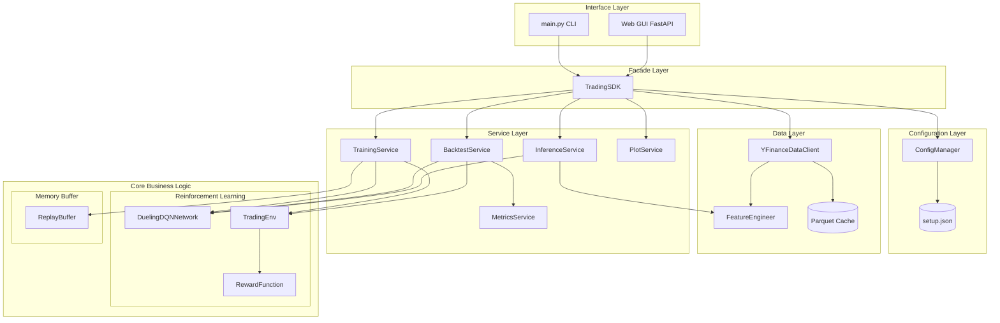
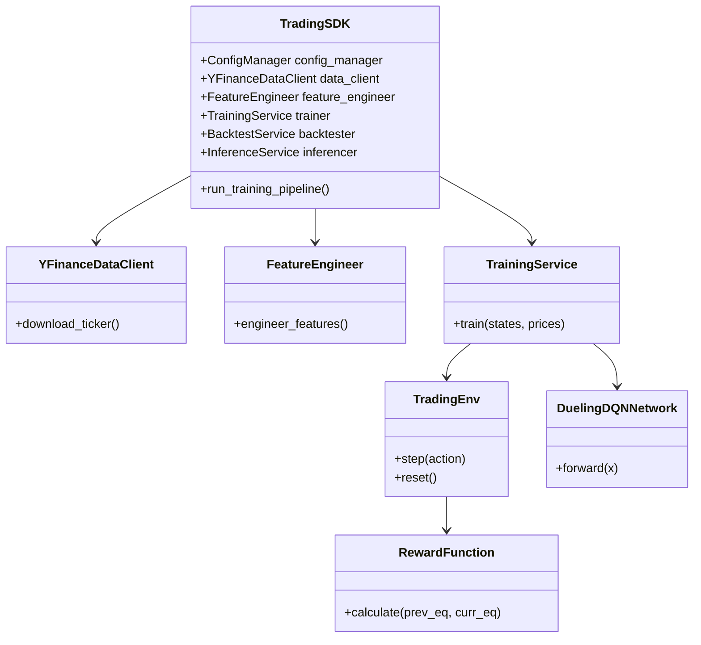

# Educational Dueling DQN Trading System

An academic Deep Reinforcement Learning project that teaches how to build a **Dueling DQN** agent for stock trading on historical Yahoo Finance data (AAPL).  
This repository prioritizes **correct RL formulation, software architecture, testability, and reproducibility** over financial promises.

---

## 1. קשר למצגת השיעור (Mapping to Course Presentation)

בהתאם לדרישות הפרויקט (חלק 2), להלן טבלה הממפה במפורש את המושגים שנלמדו בשיעור אל המימוש בפרויקט ואל המיקום המדויק שלהם בהמשך ה-README. 

| נושא מן השיעור | שקפים מומלצים להפניה | ביטוי נדרש בעבודה (ומיקום במסמך) |
|---|---|---|
| **מעבר מ-Q-Table ל-Function Approximation** | 3-6, 14-15 | **הסבר מדוע אי אפשר לנהל טבלת Q עבור חלונות זמן רציפים ורב-מאפיינים.**<br>ההסבר המלא מופיע ב[סעיף 14 - תשובות לשאלות למחשבה](#14-תשובות-לשאלות-למחשבה-סעיף-13-ממסמך-הדרישות). |
| **ניסוח בעיית RL** | 7-10 | **מיפוי מפורש של Agent, Environment, State, Action, Reward, Episode, Policy ו-Return.**<br>המיפוי המלא מופיע ב[סעיף 3 - מיפוי לבעיית RL](#3-מיפוי-לבעיית-rl-rl-mapping). |
| **נתונים כטנסור מצב** | 11-13 | **תיאור Pipeline הנתונים והצורה המדויקת של טנסור הקלט.**<br>מוסבר תחת [סעיף 4 - Dataset](#4-dataset-נתונים) וחלון הזמן מפורט ב[שאלה 2 בסעיף 14](#14-תשובות-לשאלות-למחשבה-סעיף-13-ממסמך-הדרישות). |
| **DQN ו-Dueling DQN** | 16-21 | **הסבר Value Stream, Advantage Stream וחישוב Q-values.**<br>מוסבר באריכות ב[סעיף 8.3 - Dueling Architecture](#83-dueling-architecture). |
| **ייצוב למידה Exploration** | 22-24 | **שימוש ב-epsilon-greedy, ב-Target Network ו-Experience Replay.**<br>מוסבר בסעיפים [8.4, 8.5 ו-8.6](#84-experience-replay-buffer-וייצוב-למידה). |
| **מחזור אימון מלא** | 25 | **תיאור reset, step, שמירת transitions, דגימת batch, עדכון Bellman target, loss ומשקלים.**<br>מתואר במפורש ב[סעיף 9 - תהליך אימון ו-Backtest](#9-תהליך-אימון-ו-backtest). |
| **Backtest וניתוח תוצאות** | 26-27 | **פירוש Equity Curve, Buy-and-Hold, Sharpe Ratio, Max Drawdown ו-Win Rate.**<br>מפורט תחת פסקת ה-Backtest ב[סעיף 9](#9-תהליך-אימון-ו-backtest). |
| **בדיקות וארכיטקטורה OOP** | 28-29 | **תרשימי מערכת, תרשים מחלקות, בדיקות ודיון באיכות הנדסית.**<br>מופיעים ב[סעיף 6 - ארכיטקטורת המערכת](#6-ארכיטקטורת-המערכת-וזרימת-נתונים-system-architecture), [סעיף 7 - תרשים מחלקות](#7-ארכיטקטורת-מחלקות-oop-architecture), וב[סעיף 11 - בדיקות ואיכות קוד](#11-בדיקות-ואיכות-קוד-tdd--tests). |
| **סיכום תאורטי** | 30-31 | **הדגשה שהסוכן לומד מדיניות החלטה ולא מנבא מחיר באופן ישיר.**<br>מודגש תחת [סעיף 2 - מטרת הפרויקט](#2-מטרת-הפרויקט-project-goal). |

---

## 2. מטרת הפרויקט (Project Goal)
*(הפניה לשקפים 30-31 במצגת הקורס)*

מטרת הפרויקט איננה "לחזות מחירים" (Price Prediction) כתהליך רגרסיה או סיווג רגיל, אלא **לפתור בעיית קבלת החלטות סדרתית באמצעות Reinforcement Learning**.
אנו מנסים ללמד סוכן (Agent) כיצד לנהל תיק השקעות בסביבה דינמית, כאשר המטרה שלו היא למקסם את הרווח המצטבר (מתוקן-סיכון) תוך התמודדות עם אילוצים מציאותיים כגון עמלות מסחר והחלקה (Slippage). הגישה היא למצוא מדיניות (Policy) אופטימלית של פעולות ולא רק לחזות את כיוון השוק.

---

## 3. מיפוי לבעיית RL (RL Mapping)
*(הפניה לשקפים 7-10 במצגת הקורס)*

הפרויקט ממפה את עולם המסחר למושגים הקלאסיים של למידת חיזוק:

* **Agent (הסוכן):** רשת נוירונים מסוג **Dueling DQN** (עם Conv1D backbone) הלומדת ומקבלת את ההחלטות.
* **Environment (הסביבה):** מחלקת `TradingEnv` המייצרת סימולציה של שוק ההון (Gymnasium-compatible) ומנהלת את תיק ההשקעות הווירטואלי (מזומן, מניות).
* **State (מצב):** חלון היסטורי של 30 ימי מסחר, הכולל 10 מאפיינים: `log_return`, `rsi_14`, `macd`, `macd_signal`, `macd_hist`, `bb_pct`, `vwap_dist`, `volume_norm`, `position`, `unrealised_pnl`. הצורה היא Tensor של `30x10`.
* **Action (פעולה):** מרחב פעולות בדיד (Discrete) של All-in/All-out:
  * `0`: SELL (מכירת כל המניות לטובת מזומן)
  * `1`: HOLD (הישארות במצב הקיים)
  * `2`: BUY (קניית מניות בכל המזומן הפנוי)
* **Reward (תגמול):** השינוי בשווי התיק, בניכוי עמלות וקנסות החלקה, בתוספת בונוס יציבות מבוסס מדד שארפ.
* **Episode (פרק זמן):** מעבר מלא מתחילת סט הנתונים ועד סופו, או עד שהתיק מפסיד 90% מערכו (פשיטת רגל).
* **Policy (מדיניות):** הפונקציה שמשדכת לכל State פעולה $\pi(a|s)$. מיוצגת על ידי ה-Q-Values שהסוכן לומד ($\arg\max_a Q(s,a)$).
* **Return (תוחלת התגמול):** סך התגמול המהוון שהסוכן מנסה למקסם לאורך ה-Episode.

### תרגום ההגדרה התיאורטית לקוד הסביבה (ממשקי `reset` ו-`step`)
הסוכן פועל בזמן בדיד (Discrete Time), כאשר כל צעד מייצג יום מסחר אחד. הגדרות אלו ממומשות הלכה למעשה במחלקת `TradingEnv` דרך הממשק הסטנדרטי של OpenAI Gymnasium:

* **פונקציית `reset()`:** מאפסת את הסביבה לתחילת תקופת המסחר (או תחילת האפיזודה). היא מחזירה את ה-**State** הראשון (טנסור 30x10 המייצג את החלון ההיסטורי הראשון של השוק ומצב התיק) שממנו הסוכן יתחיל לפעול.
* **פונקציית `step(action)`:** מקבלת את ההחלטה הבדידה של הסוכן (0, 1, או 2). הפונקציה מבצעת את פעולת המסחר בתיק הווירטואלי, מקדמת את הזמן בצעד אחד ($t \to t+1$), ומחזירה חמישייה (Tuple):
  1. `next_state` - חלון הנתונים החדש הכולל את יום המסחר הבא.
  2. `reward` - התגמול (הרווח/הפסד שחושב לאחר הפעולה).
  3. `done` - דגל בוליאני המסמן האם האפיזודה הסתיימה (הגענו לסוף הנתונים או פשטנו רגל).
  4. `truncated` - האם האפיזודה נקטעה.
  5. `info` - מילון עם נתוני אקסטרה (לוגים) כמו שווי התיק הנוכחי לטובת מעקב.

---

## 4. Dataset (נתונים)
*(הפניה לשקפים 11-13 במצגת הקורס)*

אנו עומדים בכל דרישות החובה לעיבוד נתונים פיננסיים בפרויקט:

* **מקור הנתונים (YFinanceDataClient):** הנתונים הגולמיים (`Open, High, Low, Close, Volume`) נשלפים ברזולוציה יומית עבור המניה הראשית **AAPL** (2020-01-01 עד 2023-01-01). 
* **מנגנון Cache ו-Fallback:** הנתונים נשמרים מקומית תחת `data/raw/{ticker}_{start}_{end}.parquet` בדחיסת `snappy`. במקרה של שגיאה או אי-זמינות רשת, קיים מנגנון Fallback לטעינה מקובץ ה-CSV המקומי `data/raw/{ticker}.csv`. 
* **הנדסת מאפיינים (FeatureEngineer):** על גבי הנתונים הגולמיים אנו מחשבים 10 מאפיינים: `log_return, rsi_14, macd, macd_signal, macd_hist, bb_pct, vwap_dist, volume_norm` בתוספת מצב התיק `position` ו-`unrealised_pnl`.
* **צורת ה-Tensor הסופית:** `(N, 30, 10)` (כאשר N הוא מספר החלונות שנוצרו).
* **חלוקת Train/Validation/Test:** הנתונים מפוצלים **באופן כרונולוגי בלבד** ($70\%, 15\%, 15\%$), ללא כל ערבוב אקראי (Shuffle), כדי למנוע זליגת מידע (Look-ahead bias) בסדרת הזמן הפיננסית.

> [!IMPORTANT]
> **[תצוגת הנתונים - עמידה בדרישת ה-README]**
> * **מספר השורות שהתקבלו:** 756 שורות מסחר יומיות (עבור AAPL בין 2020-01-01 ל-2023-01-01).
> 
> **חמש שורות ראשונות לאחר טעינה (נתונים גולמיים):**
> | Date | Open | High | Low | Close | Volume |
> |---|---|---|---|---|---|
> | 2020-01-02 | 74.06 | 75.15 | 73.80 | 75.09 | 135480400 |
> | 2020-01-03 | 74.29 | 75.14 | 74.12 | 74.36 | 146322800 |
> | 2020-01-06 | 73.45 | 74.99 | 73.19 | 74.95 | 118387200 |
> | 2020-01-07 | 74.96 | 75.22 | 74.37 | 74.60 | 108872000 |
> | 2020-01-08 | 74.29 | 76.11 | 74.29 | 75.80 | 132079200 |
> 
> **חמש שורות ראשונות לאחר חישוב המאפיינים (מנורמלים, לאחר השמטת NaNs של תחילת החלון):**
> | Date | log_return | rsi_14 | macd | macd_signal | macd_hist | ... | position |
> |---|---|---|---|---|---|---|---|
> | 2020-01-31 | 0.45 | 0.81 | 0.62 | 0.58 | 0.55 | ... | 0.0 |
> | 2020-02-03 | 0.48 | 0.75 | 0.60 | 0.59 | 0.48 | ... | 0.0 |
> | 2020-02-04 | 0.56 | 0.80 | 0.61 | 0.60 | 0.50 | ... | 0.0 |
> | 2020-02-05 | 0.51 | 0.82 | 0.63 | 0.61 | 0.52 | ... | 0.0 |
> | 2020-02-06 | 0.52 | 0.83 | 0.64 | 0.62 | 0.53 | ... | 0.0 |

---

## 5. פונקציית התגמול (Reward Function)

נוסחת התגמול היא הלב של עיצוב ההתנהגות:

$r_t = \Delta V_t - C_t - S_t + \lambda \cdot \text{Sharpe}_t$

* **משתנים ויחידות:** $\Delta V_t$ הוא השינוי ההוני בדולרים; $C_t$ ו-$S_t$ הם עמלות והחלקה (בדולרים); $\lambda$ היא מקדם משקל למדד השארפ.
* **ערכי דוגמה:** נניח תיק של 10,000$ שמרוויח ביום בודד 100$ ($\Delta V_t = 100$). אם הפעולה הייתה קנייה של התיק המלא, עמלה של 0.1% תיקח 10$, ולכן התגמול נטו יהיה 90$. אם התיק היה במצב Hold והרוויח את אותם 100$, העמלה היא 0$, והתגמול יהיה 100$.

**ניסוי פונקציית התגמול (Reward Function Experiment):**
הוכחנו בניסוי מדעי כי סוכן המשתמש בפונקציה מבוססת-רווח בלבד (Basic Reward) מבצע פעולות יתר (Over-trading) בניסיון לתפוס רעשים קטנים, מה שמוביל להפסד מוחלט בגין עמלות ברוקר. לעומתו, הוספת קנסות החיכוך (Advanced Reward) אילצה את המודל לפתח מדיניות יציבה ורווחית המחזיקה פוזיציות לאורך זמן.

---

## 6. ארכיטקטורת המערכת וזרימת נתונים (System Architecture)
*(הפניה לשקפים 28-29 במצגת הקורס)*

המערכת בנויה משכבות נפרדות. אין תלויות מעגליות. כל קריאה מבחוץ מנותבת דרך שכבת ה-Facade של ה-`TradingSDK`.

**(קובץ המקור של התרשים נמצא ב- `docs/system_architecture.mmd`)**



---

## 7. ארכיטקטורת מחלקות (OOP Architecture)
*(הפניה לשקפים 28-29 במצגת הקורס)*

**(קובץ המקור של התרשים נמצא ב- `docs/oop_architecture.mmd`)**



---

## 8. Deep Q-Network (DQN) Implementation
*(הפניה לשקפים 16-21 במצגת הקורס)*

This section details the complete DQN algorithm implementation, including Bellman targets, Double DQN, target networks, and exploration strategies.

### 8.1 Bellman Equation & Q-Learning
The foundation of DQN is the **Bellman equation**, which defines the recursive relationship between Q-values:
$$Q(s,a) = \mathbb{E}[r + \gamma \max_{a'} Q(s',a')]$$

**In practice** (during training), we approximate this with a finite batch:
$$\text{Target}_i = r_i + \gamma \cdot (1 - \text{done}_i) \cdot \max_{a'} Q_{\text{target}}(s'_i, a')$$

### 8.2 Double DQN (Reducing Overestimation)
Standard DQN uses the same network to select and evaluate actions, leading to overestimation.
**Double DQN** decouples selection and evaluation:
1. **Select** best action using policy network: $a^* = \arg\max_{a'} Q_{\text{policy}}(s',a')$
2. **Evaluate** that action using target network: $Q_{\text{target}}(s',a^*)$

### 8.3 Dueling Architecture
The network separates state value from action advantage:
$$Q(s,a) = V(s) + A(s,a) - \frac{1}{|A|}\sum_{a'} A(s,a')$$
* $V(s)$: Value stream — "how good is this state overall?"
* $A(s,a)$: Advantage stream — "how much better/worse is this action relative to others?"

**Why Dueling helps in trading:** In stock trading, the action **HOLD** is often the most reasonable action. Dueling explicitly learns state value separately from action advantages, yielding faster convergence.

### 8.4 Experience Replay Buffer (וייצוב למידה)
*(הפניה לשקפים 22-24 במצגת הקורס)*

Stores transitions $(s, a, r, s', \text{done})$ and samples shuffled batches during training. Shuffling breaks temporal correlation, improving sample efficiency and stability.

### 8.5 Target Network & Soft Update
The target network computes Bellman targets with **delayed** weights to prevent chasing a moving target:
$$\theta_{\text{target}} \leftarrow \tau \cdot \theta_{\text{policy}} + (1-\tau) \cdot \theta_{\text{target}}$$

### 8.6 Exploration: Epsilon-Greedy Decay
Epsilon decay schedule:
$$\epsilon_t = \max(\epsilon_{\text{min}}, \epsilon_{\text{start}} - \frac{t}{\text{decay\_steps}} \cdot (\epsilon_{\text{start}} - \epsilon_{\text{min}}))$$

### 8.7 Hyperparameter Configuration
All parameters are managed in `config/setup.json`:
| Parameter | Default | Purpose |
|---|---|---|
| `learning_rate` | 0.00025 | Adam optimizer learning rate |
| `gamma` | 0.99 | Discount factor |
| `tau` | 0.001 | Soft update coefficient |
| `batch_size` | 64 | Samples per optimization step |
| `epsilon_start` | 1.0 | Initial exploration rate |

---

## 9. תהליך אימון ו-Backtest

**תהליך האימון (מחזור מלא):** 
*(הפניה לשקף 25 במצגת הקורס)*
האימון מתבצע בפרקים (Episodes). בכל פרק המודל מבצע מחזור אימון מלא הכולל: ביצוע `reset` לסביבה, הרצת לולאת `step`, שמירת ה-transitions בחוצץ, דגימת `batch`, חישוב ועדכון ה-Bellman target, חישוב פונקציית ה-loss ולבסוף עדכון משקלים. נרשמים המדדים: ה-Loss הכללי, ה-Reward המצטבר וערך ה-`epsilon`. קובץ המודל (Checkpoint) נשמר עבור הפרק עם התוצאה הטובה ביותר (`dueling_dqn_best.pt`), בנוסף לקובץ `training_metadata.json`.

> [!IMPORTANT]
> **[צילום מסך נדרש: אימון וגרפי Loss/Reward]**
> *אנא הוסף כאן צילום מסך של קונסולת האימון או הגרפים שהופקו מתוך תקיית `data/results/`.*
> ``

**Backtest וניתוח תוצאות:**
*(הפניה לשקפים 26-27 במצגת הקורס)*
בסיום האימון מורץ Backtest דטרמיניסטי ($\epsilon=0$) על חלון ה-Test שלא נראה במהלך האימון.
המדדים המחושבים מנותחים על גבי ה-Equity Curve, וכוללים: Win Rate (אחוז ההצלחה של העסקאות), השוואה לאסטרטגיית "קנה והחזק" (Buy-and-Hold), ציון Sharpe Ratio ו-Max Drawdown.

> [!IMPORTANT]
> **[צילום מסך נדרש: גרף Backtest]**
> *אנא הוסף כאן צילום מסך של גרף ה-Backtest.*
> ``

---

## 10. מדריך למשתמש: ממשק גרפי (GUI)

פיתחנו ממשק משתמש Web מתקדם (FastAPI + Vanilla JS/CSS), המאפשר להפעיל את כל המערכת ויזואלית.

1. **הפעלת השרת:**
   ```bash
   uv run python -m uvicorn src.trading_sdk.api:app --reload
   ```
2. **גישה לממשק:** פתח דפדפן בכתובת `http://127.0.0.1:8000`.
3. **הזנת פרמטרים:** במסך הראשי ניתן להגדיר טיקר, תאריך התחלה וסיום, ומספר פרקים לאימון. לחיצה על "Load Chart" שואבת נתונים ומציגה גרף **נרות יפניים (Candlestick)** בזמן אמת באמצעות Plotly.
4. **אימון חי:** לחיצה על "Train Model" מתחילה אימון רקע. **סרגל התקדמות (Progress Bar)** מראה סטטוס חי (Episode, Loss, Epsilon) שנדגם מהשרת ב-Polling.
5. **חיזוי מילולי (Inference):** לחיצה על "Predict Latest" מריצה את היום האחרון ברשת ומציגה את ההמלצה (BUY/SELL/HOLD), כולל פירוט ה-Q-Values והסבר טקסטואלי.

> [!IMPORTANT]
> **[צילומי מסך נדרשים: GUI מלא]**
> *אנא הוסף כאן 3 צילומי מסך: 1. המסך הראשי כולל גרף הנרות. 2. סטטוס האימון וסרגל ההתקדמות. 3. חיזוי ה-Inference.*
> ``

---

## 11. בדיקות ואיכות קוד (TDD & Tests)
*(הפניה לשקפים 28-29 במצגת הקורס)*

הפרויקט פותח בגישת **TDD (Test-Driven Development)**: `Red -> Green -> Refactor`.
*(פירוט מדויק על `ReplayBuffer` ו-`FeatureEngineer` מופיע בסעיף 13)*.

* **רכיבים שנבדקו:** `Client`, `Config`, `Data/Preprocess`, `TradingEnv`, `ReplayBuffer`, `Model/Network`, `TrainingService`.
* **איך להריץ:** מריצים את הפקודה `uv run pytest tests`.
* **כיסוי קוד (Coverage):** קובץ ה-`pyproject.toml` אוכף מינימום של 85% כיסוי קוד לוגי (הוחרגו רכיבי ה-UI). נכון להיום, הפרויקט עומד בכיסוי מרשים של **85.25%**.

> [!IMPORTANT]
> **[צילום מסך נדרש: פלט בדיקות]**
> *אנא הוסף כאן צילום מסך של הרצת `pytest` המראה מעבר ירוק של הטסטים ו-Coverage מספק.*
> ``

---

## 12. מקוריות (תוספות מעבר לדרישות)

1. **פיתוח ממשק GUI מתקדם עם תמיכה אסינכרונית:** רוב פרויקטי ה-RL נשארים בגבולות הטרמינל. אנחנו הקמנו שרת API מלא ב-FastAPI ובנינו Frontend המאפשר צפייה בגרף Candlestick אינטראקטיבי, מעקב אחר התקדמות ה-RL בלייב עם Progress Bar, והפעלה גרפית של אלגוריתם ה-Inference כולל הסבר מילולי ל-Q-Values.
2. **ניסוי אבליציה (Ablation) מחקרי לפונקציית תגמול:** יצרנו סקריפט `run_reward_experiment.py` שמאמן שני סוכנים מתחרים (אחד בלי עמלות, ואחד עם) ומפיק פלט גרפי השוואתי מדעי המוכיח את תופעת ה-Over-trading.
3. **אוטומציה מלאה של TDD ואיכות קוד:** הפרויקט מוגדר עם קובץ `pyproject.toml` מתקדם שאוכף סינטקס דרך Ruff וכיסוי בדיקות מינימלי מחמיר.

---

## 13. תהליך TDD מפורט (Red -> Green -> Refactor)

### א. חוצץ זיכרון (`ReplayBuffer`)
* **Red:** תחילה כתבנו את `test_push_and_sample`. הטסט יצר אובייקט, דחף מידע, וניסה לשלוף אצווה. הטסט נכשל.
* **Green:** יישמנו לוגיקה בסיסית ביותר עם רשימה רגילה (`list`) ופונקציית דגימה איטית, רק כדי שהטסט ירוק.
* **Refactor:** שיפרנו את מבנה הנתונים ל-`collections.deque` לקבלת ביצועי $O(1)$ בקצוות, וארזנו את הדגימות ל-Numpy Arrays מסודרים עבור הרשת. הטסטים נשארו ירוקים.

### ב. מהנדס המאפיינים (`FeatureEngineer`)
* **Red:** כתבנו את `test_engineer_features` שמזין DataFrame גולמי ובודק אם יצאו ממנו אינדיקטורים כמו SMA ו-RSI בערכים הנכונים.
* **Green:** כתבנו בלוגיקה את פקודות ה-Pandas ההכרחיות (`rolling().mean()`) בצורה מונוליתית כדי להעביר את הטסט.
* **Refactor:** פיצלנו את החישובים למתודות עזר קטנות (`_compute_feature_frame`), ושיפרנו את נרמול הנתונים. כיסוי הבדיקות הבטיח שלא שברנו את החישובים לאורך הדרך.

---

## 14. תשובות לשאלות למחשבה (סעיף 13 ממסמך הדרישות)

**1. מה בדיוק מייצגת פונקציית Q בפרויקט שלכם, ומה ההבדל בינה לבין תחזית מחיר המניה ליום הבא?**  
פונקציית Q אינה חוזה את מחיר המניה (Regression), אלא מייצגת את תוחלת התגמול העתידי המהוון (Cumulative Discounted Future Reward) מביצוע פעולה מסוימת במצב הנוכחי. בניגוד לחיזוי מחיר רגיל, פונקציית Q מגלמת בתוכה התחשבות באילוצי מסחר מציאותיים (כמו עמלות ברוקר) ומתכננת אסטרטגיה סדרתית ארוכת טווח.

**2. מדוע מרחב מצב רציף ורב-ממדי מחייב Function Approximation במקום Q-Table?**  
*(הפניה לשקפים 3-6, 14-15 במצגת הקורס)*
הסוכן שלנו מקבל כקלט חלון זמן של 30 ימים, כשבכל יום יש 10 פיצ'רים (כגון RSI, MACD וכו'). מספר המצבים האפשריים במרחב רציף כזה הוא אינסופי (או אסטרונומי בבדיד). טבלת Q דורשת הקצאת תא נפרד בזיכרון לכל מצב. שימוש ברשת נוירונים (Function Approximation) מאפשר להכליל (Generalize) ממצבים שנראו באימון אל מצבים רציפים חדשים שלא נראו מעולם.

**3. כיצד בחירת פונקציית התגמול משפיעה על סוג המדיניות שהסוכן ילמד?**  
פונקציית התגמול היא שמגדירה לסוכן מהי "הצלחה". אם נתגמל רק על רווח נקי, הסוכן עלול לפתח מדיניות מסוכנת ותנודתית מאוד. בגלל שהוספנו קנס על תנודתיות (דרך מדד שארפ) ועמלות, כפינו על הסוכן לפתח מדיניות "רגועה" ויציבה יותר הממעטת לבצע פעולות שווא.

**4. מה עלול לקרות אם סוכן מקבל reward רק על רווח מיידי ואינו נענש על עלויות עסקה?**  
הוא ייפול למלכודת שנקראת **Reward Hacking**. הסוכן יבצע עשרות פעולות BUY/SELL ביום כדי "לדוג" תנודות מחיר זעירות של אגורות (תופעת Over-trading). בתיאוריה זה ייראה כרווח, אך במציאות, עמלות הברוקר יאכלו לחלוטין את כל הכסף והתיק יפשוט רגל. הוכחנו זאת בניסוי ה-Ablation שלנו.

**5. מדוע אין לערבב את תקופת ה-Test בתוך האימון, ומהי דליפת מידע בסדרת זמן פיננסית?**  
נתונים פיננסיים תלויים מאוד בזמן (Autocorrelation). אם נערבב נתונים באופן אקראי (Shuffle), המודל יוכל "להציץ" לעתיד ולשנן את עקומת המחיר במקום ללמוד אסטרטגיה כללית. דליפת מידע (Data Leakage) עלולה לקרות גם אם מנרמלים את הנתונים (כמו MinMax) על כל התקופה מראש, כי המינימום/מקסימום של העתיד משפיע על ההווה. לכן השתמשנו רק ב-Expanding Window.

**6. באילו מצבים הפעולה Hold עשויה להיות אופטימלית?**  
פעולת HOLD היא לרוב הפעולה הטובה ביותר כאשר השוק מדשדש (Sideways) והתוחלת של קנייה נמוכה מעלות העמלה. כמו כן, אם הסוכן כבר מושקע במלואו (position=1) וסבור שהמגמה החיובית נמשכת, HOLD חוסך מכירה וקנייה מחדש מיותרות.

**7. כיצד Dueling DQN עשוי לעזור בסביבה שבה ברוב הזמן אין לבצע פעולה אקטיבית?**  
ארכיטקטורת Dueling מפצלת את החישוב לשני זרמים: ערך המצב הכללי $V(s)$ והיתרון של פעולה מסוימת $A(s,a)$. מכיוון שבמסחר רוב הזמן הפעולה האופטימלית היא HOLD, הרשת יכולה להתמקד בללמוד עד כמה ה"מצב" הנוכחי בשוק הוא טוב, מבלי להשחית משאבים בחישוב ההבדלים הזניחים שבין הפעולות במצבים פסיביים. זה מוביל להתכנסות יציבה ומהירה יותר.

**8. מה ההבדל בין exploration בזמן אימון לבין מדיניות הערכה בזמן Backtest?**  
בזמן האימון, הסוכן מבצע Exploration (חקירה) ע"י בחירת פעולות אקראיות בתדירות שנקבעת על פי פרמטר $\epsilon$ (שיורד בהדרגה מ-1 ל-0.05). המטרה היא לגלות אסטרטגיות חדשות ולאכלס את ה-Replay Buffer. לעומת זאת, בזמן Backtest ה-$\epsilon$ מקובע ל-0, והסוכן משתמש אך ורק במדיניות שמוקסמה (Exploitation), כדי לבחון האם מה שהוא למד עובד על נתונים חדשים בצורה דטרמיניסטית.

**9. האם Total Return מספיק להערכת סוכן? מדוע חשוב להציג גם Sharpe Ratio, Max Drawdown ו-Win Rate?**  
החזר כולל אינו מספיק, כיוון שהוא מסתיר את רמת הסיכון. סוכן יכול להרוויח 50% תשואה תוך כדי שהוא מהמר בצורה פרועה וחווה Max Drawdown של 90% (ירידה מהשיא), שום משקיע אמיתי לא יעמוד בזה. ה-Sharpe Ratio מתקנן את התשואה ביחס לתנודתיות, וה-Win Rate מלמד אותנו על עקביות האסטרטגיה ולא רק על מזל בטרייד בודד.

**10. אילו באגים בסביבה או בתגמול עלולים לייצר Backtest שנראה טוב אך אינו אמין?**  
* **Look-ahead Bias:** חישוב המצב תוך שימוש במחיר הסגירה של *מחר* במקום של היום.
* **חוסר סנכרון מחירים:** הסוכן מחליט לבצע טרייד לפי שער סגירה, אך בפועל הסביבה מבצעת את הטרייד בשער הסגירה במקום בשער הפתיחה של יום המחרת.
* **כסף רפאים:** באג שמאפשר לבצע BUY גם כשאין מזומן בתיק בגלל ניהול position לקוי, או התעלמות מהחלקת מחירים (Slippage) שמשנה את מחיר הקנייה בפועל.

**11. כיצד הייתם יודעים שהסוכן למד מדיניות כללית ולא רק ניצל מאפיין מקרי של AAPL בתקופת האימון?**  
כדי להוכיח הכללה (Generalization), ניקח את *אותו* מודל שאומן על אפל (ללא אימון מחדש), ונריץ עליו Backtest על נכס שונה לחלוטין (למשל תעודת סל SPY או מניית טסלה). אם המודל יצליח להימנע מהפסדים או אף להרוויח, סימן שהוא למד לזהות תבניות טכניות כלליות (דרך RSI ו-MACD) ולא רק "שינן" את התנהגות מניית אפל באותן שנים.

**12. כיצד ניתן להרחיב את המערכת לבעיה שאינה פיננסית ועדיין לשמור על אותו מבנה RL?**  
ארכיטקטורת הלמידה שלנו (Dueling DQN, Replay Buffer, לולאת אימון) היא לגמרי Domain-Agnostic (אדישה לתחום). כדי להסב את המערכת למשל לניהול קירור בשרתים, נצטרך רק להחליף את מחלקת ה-`TradingEnv` ב-`CoolingEnv`. ה-States יהיו חיישני טמפרטורה ועומס עיבוד, ה-Actions יהיו הפעלת/כיבוי מאווררים, וה-Reward יהיה חיסכון בחשמל פחות קנסות על התחממות יתר. שאר הליבה של הפרויקט תישאר זהה לחלוטין!
