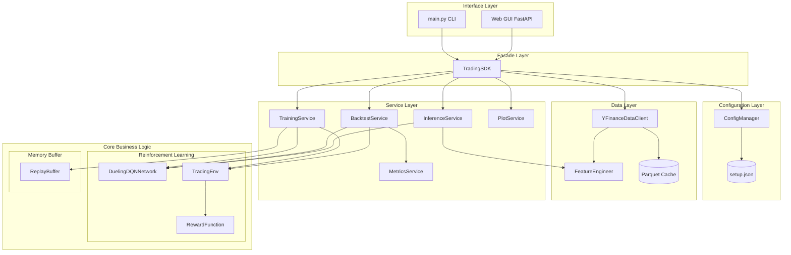
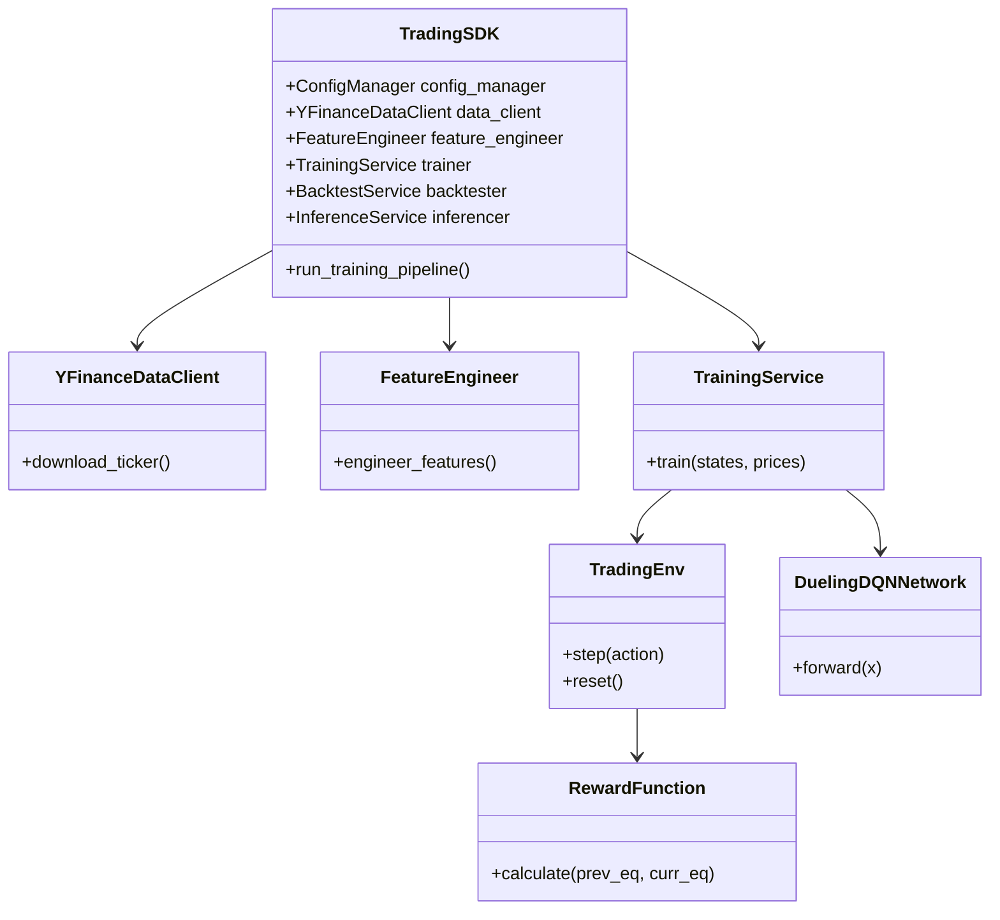

# Educational Dueling DQN Trading System

An academic Deep Reinforcement Learning project that teaches how to build a **Dueling DQN** agent for stock trading on historical Yahoo Finance data (AAPL).  
This repository prioritizes **correct RL formulation, software architecture, testability, and reproducibility** over financial promises.

---

## 1. מטרת הפרויקט (Project Goal)

מטרת הפרויקט איננה "לחזות מחירים" (Price Prediction) כתהליך רגרסיה או סיווג רגיל, אלא **לפתור בעיית קבלת החלטות סדרתית באמצעות Reinforcement Learning**.
אנו מנסים ללמד סוכן (Agent) כיצד לנהל תיק השקעות בסביבה דינמית, כאשר המטרה שלו היא למקסם את הרווח המצטבר (מתוקן-סיכון) תוך התמודדות עם אילוצים מציאותיים כגון עמלות מסחר והחלקה (Slippage). הגישה היא למצוא מדיניות (Policy) אופטימלית של פעולות ולא רק לחזות את כיוון השוק.

---

## 2. מיפוי לבעיית RL (RL Mapping)

הפרויקט ממפה את עולם המסחר למושגים הקלאסיים של למידת חיזוק:

* **Agent (הסוכן):** רשת נוירונים מסוג **Dueling DQN** (עם Conv1D backbone) הלומדת ומקבלת את ההחלטות.
* **Environment (הסביבה):** מחלקת `TradingEnv` המייצרת סימולציה של שוק ההון (Gymnasium-compatible) ומנהלת את תיק ההשקעות הווירטואלי (מזומן, מניות).
* **State (מצב):** חלון היסטורי של 30 ימי מסחר, הכולל 10 מאפיינים: `log_return`, `rsi_14`, `macd`, `macd_signal`, `macd_hist`, `bb_pct`, `vwap_dist`, `volume_norm`, `position`, `unrealised_pnl`. הצורה היא Tensor של `30x10`.
* **Action (פעולה):** מרחב פעולות בדיד (Discrete) של All-in/All-out:
  * `0`: SELL (מכירת כל המניות לטובת מזומן)
  * `1`: HOLD (הישארות במצב הקיים)
  * `2`: BUY (קניית מניות בכל המזומן הפנוי)
* **Reward (תגמול):** השינוי בשווי התיק, בניכוי עמלות וקנסות החלקה, בתוספת בונוס יציבות מבוסס מדד שארפ.
* **Episode (פרק זמן):** מעבר מלא מתחילת סט הנתונים ועד סופו, או עד שהתיק מפסיד 90% מערכו (פשיטת רגל).
* **Policy (מדיניות):** הפונקציה שמשדכת לכל State פעולה $\pi(a|s)$. מיוצגת על ידי ה-Q-Values שהסוכן לומד ($\arg\max_a Q(s,a)$).

---

## 3. Dataset (נתונים)

* **מקור הנתונים:** Yahoo Finance (דרך ספריית `yfinance`).
* **קוד אחזור:** הפעולה מתבצעת במחלקת `YFinanceDataClient` המורידה את הנתונים, שומרת ב-Cache של Parquet עם דחיסת Snappy.
* **חלוקה:** חלוקה כרונולוגית בלבד (למניעת Look-ahead bias): 70% Train, 15% Validation, 15% Test.
* **צורת ה-Tensor:** כאמור, כל חלון שמוזן לרשת הוא בצורה של `(Batch, 30, 10)`.

```python
# Example Data Fetching Snippet
if cache_file.exists():
    df = pd.read_parquet(cache_file)
else:
    df = yf.download(TICKER, start=START, end=END, interval="1d", progress=False)
    df.to_parquet(cache_file, compression="snappy")
```

> [!IMPORTANT]
> **[צילום מסך נדרש: טעינת נתונים]**
> *אנא הוסף כאן צילום מסך של פלט סקריפט `verify_data.py` או לוג של טעינת הנתונים.*
> ``

---

## 4. פונקציית התגמול (Reward Function)

נוסחת התגמול היא הלב של עיצוב ההתנהגות:

$r_t = \Delta V_t - C_t - S_t + \lambda \cdot \text{Sharpe}_t$

* **משתנים ויחידות:** $\Delta V_t$ הוא השינוי ההוני בדולרים; $C_t$ ו-$S_t$ הם עמלות והחלקה (בדולרים); $\lambda$ היא מקדם משקל למדד השארפ.
* **ערכי דוגמה:** נניח תיק של 10,000$ שמרוויח ביום בודד 100$ ($\Delta V_t = 100$). אם הפעולה הייתה קנייה של התיק המלא, עמלה של 0.1% תיקח 10$, ולכן התגמול נטו יהיה 90$. אם התיק היה במצב Hold והרוויח את אותם 100$, העמלה היא 0$, והתגמול יהיה 100$.

**ניסוי פונקציית התגמול (Reward Function Experiment):**
הוכחנו בניסוי מדעי כי סוכן המשתמש בפונקציה מבוססת-רווח בלבד (Basic Reward) מבצע פעולות יתר (Over-trading) בניסיון לתפוס רעשים קטנים, מה שמוביל להפסד מוחלט בגין עמלות ברוקר. לעומתו, הוספת קנסות החיכוך (Advanced Reward) אילצה את המודל לפתח מדיניות יציבה ורווחית המחזיקה פוזיציות לאורך זמן.

---

## 5. ארכיטקטורת המערכת וזרימת נתונים (System Architecture)

המערכת בנויה משכבות נפרדות. אין תלויות מעגליות. כל קריאה מבחוץ מנותבת דרך שכבת ה-Facade של ה-`TradingSDK`.

**(קובץ המקור של התרשים נמצא ב- `docs/system_architecture.mmd`)**



---

## 6. ארכיטקטורת מחלקות (OOP Architecture)

**(קובץ המקור של התרשים נמצא ב- `docs/oop_architecture.mmd`)**



---

## 7. Deep Q-Network (DQN) Implementation

This section details the complete DQN algorithm implementation, including Bellman targets, Double DQN, target networks, and exploration strategies.

### 7.1 Bellman Equation & Q-Learning
The foundation of DQN is the **Bellman equation**, which defines the recursive relationship between Q-values:
$$Q(s,a) = \mathbb{E}[r + \gamma \max_{a'} Q(s',a')]$$

**In practice** (during training), we approximate this with a finite batch:
$$\text{Target}_i = r_i + \gamma \cdot (1 - \text{done}_i) \cdot \max_{a'} Q_{\text{target}}(s'_i, a')$$

### 7.2 Double DQN (Reducing Overestimation)
Standard DQN uses the same network to select and evaluate actions, leading to overestimation.
**Double DQN** decouples selection and evaluation:
1. **Select** best action using policy network: $a^* = \arg\max_{a'} Q_{\text{policy}}(s',a')$
2. **Evaluate** that action using target network: $Q_{\text{target}}(s',a^*)$

### 7.3 Dueling Architecture
The network separates state value from action advantage:
$$Q(s,a) = V(s) + A(s,a) - \frac{1}{|A|}\sum_{a'} A(s,a')$$
* $V(s)$: Value stream — "how good is this state overall?"
* $A(s,a)$: Advantage stream — "how much better/worse is this action relative to others?"

**Why Dueling helps in trading:** In stock trading, the action **HOLD** is often the most reasonable action. Dueling explicitly learns state value separately from action advantages, yielding faster convergence.

### 7.4 Experience Replay Buffer
Stores transitions $(s, a, r, s', \text{done})$ and samples shuffled batches during training. Shuffling breaks temporal correlation, improving sample efficiency and stability.

### 7.5 Target Network & Soft Update
The target network computes Bellman targets with **delayed** weights to prevent chasing a moving target:
$$\theta_{\text{target}} \leftarrow \tau \cdot \theta_{\text{policy}} + (1-\tau) \cdot \theta_{\text{target}}$$

### 7.6 Exploration: Epsilon-Greedy Decay
Epsilon decay schedule:
$$\epsilon_t = \max(\epsilon_{\text{min}}, \epsilon_{\text{start}} - \frac{t}{\text{decay\_steps}} \cdot (\epsilon_{\text{start}} - \epsilon_{\text{min}}))$$

### 7.7 Hyperparameter Configuration
All parameters are managed in `config/setup.json`:
| Parameter | Default | Purpose |
|---|---|---|
| `learning_rate` | 0.00025 | Adam optimizer learning rate |
| `gamma` | 0.99 | Discount factor |
| `tau` | 0.001 | Soft update coefficient |
| `batch_size` | 64 | Samples per optimization step |
| `epsilon_start` | 1.0 | Initial exploration rate |

---

## 8. תהליך אימון ו-Backtest

**תהליך האימון:** 
האימון מתבצע בפרקים (Episodes). בכל פרק נרשמים מדדים: ה-Loss הכללי, ה-Reward המצטבר וערך ה-`epsilon`. קובץ המודל (Checkpoint) נשמר עבור הפרק עם התוצאה הטובה ביותר (`dueling_dqn_best.pt`), בנוסף לקובץ `training_metadata.json`.

> [!IMPORTANT]
> **[צילום מסך נדרש: אימון וגרפי Loss/Reward]**
> *אנא הוסף כאן צילום מסך של קונסולת האימון או הגרפים שהופקו מתוך תקיית `data/results/`.*
> ``

**Backtest:**
בסיום האימון מורץ Backtest דטרמיניסטי ($\epsilon=0$) על חלון ה-Test שלא נראה במהלך האימון.
המדדים המחושבים: תשואה מצטברת, מדד שארפ, ירידה מקסימלית (Max Drawdown), בהשוואה לאסטרטגיית "קנה והחזק" (Buy-and-Hold).

> [!IMPORTANT]
> **[צילום מסך נדרש: גרף Backtest]**
> *אנא הוסף כאן צילום מסך של גרף ה-Backtest.*
> ``

---

## 9. מדריך למשתמש: ממשק גרפי (GUI)

פיתחנו ממשק משתמש Web מתקדם (FastAPI + Vanilla JS/CSS), המאפשר להפעיל את כל המערכת ויזואלית.

1. **הפעלת השרת:**
   ```bash
   uv run python -m uvicorn src.trading_sdk.api:app --reload
   ```
2. **גישה לממשק:** פתח דפדפן בכתובת `http://127.0.0.1:8000`.
3. **הזנת פרמטרים:** במסך הראשי ניתן להגדיר טיקר, תאריך התחלה וסיום, ומספר פרקים לאימון. לחיצה על "Load Chart" שואבת נתונים ומציגה גרף **נרות יפניים (Candlestick)** בזמן אמת באמצעות Plotly.
4. **אימון חי:** לחיצה על "Train Model" מתחילה אימון רקע. **סרגל התקדמות (Progress Bar)** מראה סטטוס חי (Episode, Loss, Epsilon) שנדגם מהשרת ב-Polling.
5. **חיזוי מילולי (Inference):** לחיצה על "Predict Latest" מריצה את היום האחרון ברשת ומציגה את ההמלצה (BUY/SELL/HOLD), כולל פירוט ה-Q-Values והסבר טקסטואלי.

> [!IMPORTANT]
> **[צילומי מסך נדרשים: GUI מלא]**
> *אנא הוסף כאן 3 צילומי מסך: 1. המסך הראשי כולל גרף הנרות. 2. סטטוס האימון וסרגל ההתקדמות. 3. חיזוי ה-Inference.*
> ``

---

## 10. בדיקות ואיכות קוד (TDD & Tests)

הפרויקט פותח בגישת **TDD (Test-Driven Development)**: `Red -> Green -> Refactor`.
*(פירוט מדויק על `ReplayBuffer` ו-`FeatureEngineer` מופיע בסעיף 13)*.

* **רכיבים שנבדקו:** `Client`, `Config`, `Data/Preprocess`, `TradingEnv`, `ReplayBuffer`, `Model/Network`, `TrainingService`.
* **איך להריץ:** מריצים את הפקודה `uv run pytest tests`.
* **כיסוי קוד (Coverage):** קובץ ה-`pyproject.toml` אוכף מינימום של 85% כיסוי קוד לוגי (הוחרגו רכיבי ה-UI). נכון להיום, הפרויקט עומד בכיסוי מרשים של **85.25%**.

> [!IMPORTANT]
> **[צילום מסך נדרש: פלט בדיקות]**
> *אנא הוסף כאן צילום מסך של הרצת `pytest` המראה מעבר ירוק של הטסטים ו-Coverage מספק.*
> ``

---

## 11. תשובות לשאלות למחשבה (סעיף 13)

1. **מדוע להשתמש ב-Dueling DQN ולא ב-DQN רגיל בסביבת מסחר?**
   במסחר מניות, פעולת ה-HOLD נפוצה ביותר. לעיתים תכופות, השוק נע אופקית והפעולות BUY/SELL לא משנות משמעותית את המצב. Dueling DQN לומד את הערך העקרוני של ה"מצב" (האם אנחנו בשוק שורי או דובי) בנפרד מה"יתרון" של כל פעולה, וכך מתכנס מהר יותר וביעילות בסביבות כאלו.
2. **איך וידאנו שלא מתרחש Look-ahead Bias (זליגת נתונים עתידיים)?**
   א. חילקנו את הנתונים כרונולוגית בלבד (ללא Shuffle אקראי של הסט המלא). 
   ב. בנרמול הנתונים, השתמשנו במנגנון Expanding Window, כלומר המינימום/מקסימום מחושב אך ורק עד לנקודת הזמן הנוכחית ($T$) ולא על פני כל הסט.
3. **למה קנס העמלות כה משמעותי בפונקציית ה-Reward?**
   ללא עמלות, מודל RL לומד לנצל "רעש" זעיר במחירים וקונה/מוכר מדי יום. במציאות, הפסדים מצטברים מהחלקת מחירים (Slippage) ועמלות ברוקר שוחקים את התיק במהירות.

---

## 12. מקוריות (תוספות מעבר לדרישות)

1. **פיתוח ממשק GUI מתקדם עם תמיכה אסינכרונית:** רוב פרויקטי ה-RL נשארים בגבולות הטרמינל. אנחנו הקמנו שרת API מלא ב-FastAPI ובנינו Frontend המאפשר צפייה בגרף Candlestick אינטראקטיבי, מעקב אחר התקדמות ה-RL בלייב עם Progress Bar, והפעלה גרפית של אלגוריתם ה-Inference כולל הסבר מילולי ל-Q-Values.
2. **ניסוי אבליציה (Ablation) מחקרי לפונקציית תגמול:** יצרנו סקריפט `run_reward_experiment.py` שמאמן שני סוכנים מתחרים (אחד בלי עמלות, ואחד עם) ומפיק פלט גרפי השוואתי מדעי המוכיח את תופעת ה-Over-trading.
3. **אוטומציה מלאה של TDD ואיכות קוד:** הפרויקט מוגדר עם קובץ `pyproject.toml` מתקדם שאוכף סינטקס דרך Ruff וכיסוי בדיקות מינימלי מחמיר.

---

## 13. תהליך TDD מפורט (Red -> Green -> Refactor)

### א. חוצץ זיכרון (`ReplayBuffer`)
* **Red:** תחילה כתבנו את `test_push_and_sample`. הטסט יצר אובייקט, דחף מידע, וניסה לשלוף אצווה. הטסט נכשל.
* **Green:** יישמנו לוגיקה בסיסית ביותר עם רשימה רגילה (`list`) ופונקציית דגימה איטית, רק כדי שהטסט ירוק.
* **Refactor:** שיפרנו את מבנה הנתונים ל-`collections.deque` לקבלת ביצועי $O(1)$ בקצוות, וארזנו את הדגימות ל-Numpy Arrays מסודרים עבור הרשת. הטסטים נשארו ירוקים.

### ב. מהנדס המאפיינים (`FeatureEngineer`)
* **Red:** כתבנו את `test_engineer_features` שמזין DataFrame גולמי ובודק אם יצאו ממנו אינדיקטורים כמו SMA ו-RSI בערכים הנכונים.
* **Green:** כתבנו בלוגיקה את פקודות ה-Pandas ההכרחיות (`rolling().mean()`) בצורה מונוליתית כדי להעביר את הטסט.
* **Refactor:** פיצלנו את החישובים למתודות עזר קטנות (`_compute_feature_frame`), ושיפרנו את נרמול הנתונים. כיסוי הבדיקות הבטיח שלא שברנו את החישובים לאורך הדרך.
